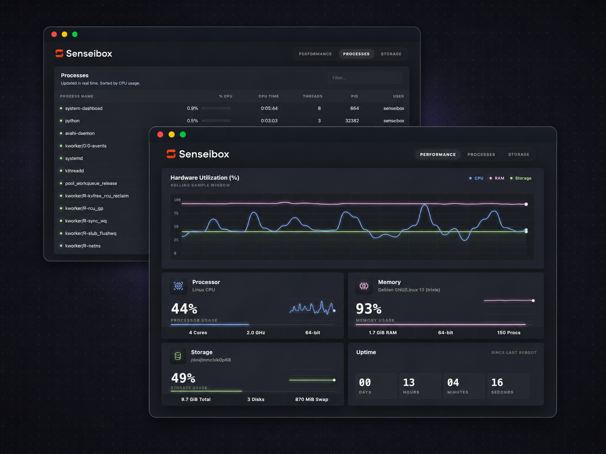

# Senseibox KPI

A small Linux-only system telemetry dashboard designed for lightweight server boards.
It exposes simple JSON APIs and streams live updates to a clean HTML/CSS/JS dashboard.



Note: This project targets Linux servers. macOS and Windows are intentionally out of scope.

## Features

- CPU, memory, storage, process, swap, and uptime telemetry
- REST APIs for easy scripts and tests
- WebSocket stream for live dashboard updates every 3 seconds
- Static frontend with no build step
- systemd service template for boot startup
- Linux `/proc`, `/sys`, and core utilities only; no heavyweight metrics agent

## API

```text
GET /api/usage
GET /api/uptime
GET /api/info
GET /api/snapshot
GET /api/version
GET /api/processes
GET /api/storage/filesystems
GET /api/storage/files
WS  /ws/metrics
```

Example `/api/usage`:

```json
{"processor":0,"ram":13,"storage":69}
```

Example `/api/uptime`:

```json
{"days":"00","hours":"00","minutes":"31","seconds":"23"}
```

Example `/api/version`:

```json
{"version":"0.1.0"}
```

## Run Locally

```bash
python -m venv .venv
. .venv/bin/activate
pip install -e .
system-dashboard --host 0.0.0.0 --port 8080
```

Then open `http://localhost:8080`.

## Install As A Service

After checking out the repo on a Linux system, run:

```bash
sudo ./install.sh
```

The installer copies the app into `/opt/senseibox/senseibox-kpi`, creates the
`senseibox` service user when needed, builds the virtualenv, installs the
systemd service, and starts it on port `8001`.

Check it:

```bash
systemctl status senseibox-kpi --no-pager
journalctl -u senseibox-kpi -f
curl http://127.0.0.1:8001/api/snapshot
```

Open `http://<server-ip>:8001/`.

The tracked service file lives at `systemd/senseibox-kpi.service`.


## License

This software is licensed under the [GPL-3.0](LICENSE).
